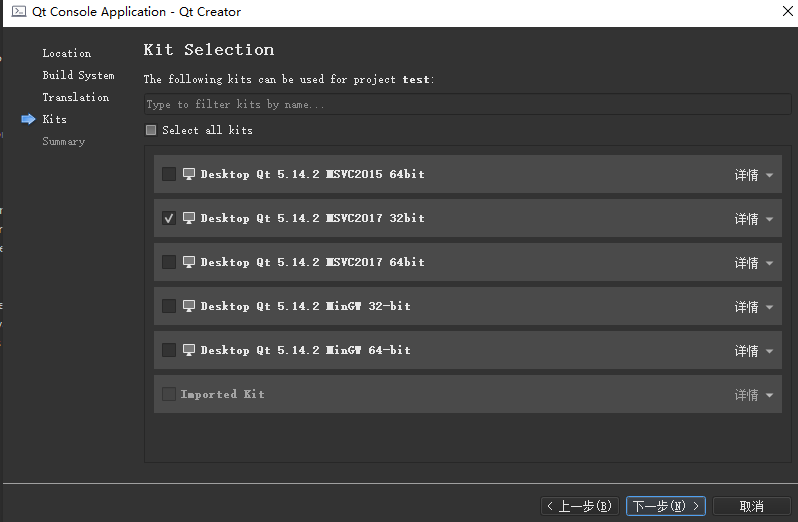
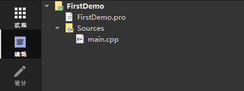
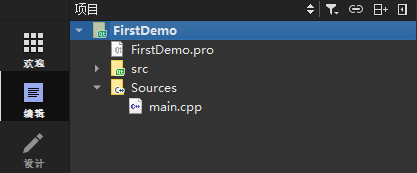
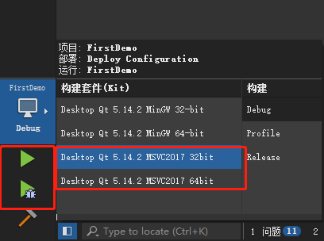

# 安装 IWebCore 

`IWebCore` 目前是使用 `qmake` 进行编译，所以我们需要`Qt`的开发环境并 `Qt Creator` IDE。所以第一步，我们是安装环境。

> NOTE:在以后的版本中，`IWebCore` 会同时支持 `qmake`和 `cmake` 管理，支持 `Visual Studio` 和 `CLion` 等其他的IDE. 现阶段开发环境暂定只能在 `Qt Creator` 上进行开发和编译。

在安装 Qt Creator 之前，我们先安装 `Visual Studio` 版本不低于 2017 版本。这样我们在之后安装Qt Creator 时，可以勾选vs2017 或 vs2019 版本的 msvc 编译器。这样省去了之后配置编译器的麻烦。

同时这里要求 msvc 编译器的原因则是 msvc 编译器的编译速度极快。在本人的电脑上_(Intel(R) Core(TM) i5-3230M, 12GB 内存， 120G 固态盘)_的条件上面，使用 `msvc` 编译器在1分钟以内编译完成，使用 `mingw` 编译器需要6分钟，在阿里云 linux主机上面_(一核2GB )_ 使用 `GCC` 编译则需要 20分钟以上。

所以为了缩短开发的时间，同时能够使用`Linux` 主机运行应用，我们选择首先在 windows 上面使用 `MSVC` 编译器进行开发。使用`Qt Creator` 自带的`mingw` 编译器初步验证程序是否能在`Linux` 上编译通过，而最后在linux 上使用相应的编译器如`GCC` 进行编译并发布。

下面我们安装编译环境。

## 编译环境安装

- 安装 VS 
    - 从 https://visualstudio.microsoft.com/ 上面下载并安装 visual studio installer并运行，按照提示进行安装 VS. 要求 VS 版本不低于 2017。 
    - 如果是个人开发，可以选择 社区版本进行安装。

- 安装 Qt Creator

    - 从 [Index of / (qt.io)](https://download.qt.io/) 或者其他的镜像网站下载 Qt 进行安装，要求版本不低于 Qt5.12。
    - 注意在安装过程中选择编译器时，勾选`mingw` 和 `msvc` 两种编译器类型。

- 安装完的验证。

    打开Qt，创建一个 Qt应用，当弹框出现如下界面时，说明安装成功。

    


## IWebCore 下载

从 github `TODO: 地址` 上面下载 IWebCore,解压缩，可以看到目录结构如下所示

```ini
|- iwebcore
	|- demo
	|- src
		|- assertion
		|- base
		...
		|- src.pri
	|- test
	|- IWebCore.pro
```

其中`demo` 文件夹是提供的一些案例，能够直接运行。 `src` 是源码文件夹，是我们所需要用的的东西。`test` 是单元测试文件夹。`IWebCore.pro` 是项目的管理文件。

所需要的是 `src` 文件夹中提供的源码文件，在使用时，我们可以直接复制 src 文件夹到我们的工程目录或者直接引用 `src.pri` 文件到我们的工程 `.pro` 文件当中。

## 创建一个应用

这里我们从已经创建好的环境，和已经下载好的代码创建一个最简单的服务器。

首先创建一个`Qt Console Application`取名为 FirstDemo, 编译器选择的时候，全选所有的编译器。

创建完成的目录结构如下:



可以看见整个项目当中只有两个文件一个 `FirstDemo.pro`, 一个 `main.cpp`

我们打开 `FirstDemo.pro`

```properties linenums='1'
QT -= gui

CONFIG += c++11 console
CONFIG -= app_bundle

# The following define makes your compiler emit warnings if you use
# any Qt feature that has been marked deprecated (the exact warnings
# depend on your compiler). Please consult the documentation of the
# deprecated API in order to know how to port your code away from it.
DEFINES += QT_DEPRECATED_WARNINGS

# You can also make your code fail to compile if it uses deprecated APIs.
# In order to do so, uncomment the following line.
# You can also select to disable deprecated APIs only up to a certain version of Qt.
#DEFINES += QT_DISABLE_DEPRECATED_BEFORE=0x060000    # disables all the APIs deprecated before Qt 6.0.0

SOURCES += \
        main.cpp

# Default rules for deployment.
qnx: target.path = /tmp/$${TARGET}/bin
else: unix:!android: target.path = /opt/$${TARGET}/bin
!isEmpty(target.path): INSTALLS += target

```

首先在第一行，我们看见 Qt 排除了`gui` 的库。第三行，定义的c++11的编译选项，并console 编译选项。在第17-18行 定义main.cpp 文件。

那么我们对这个文件进行修改一下，以包含 `IWebCore` 的库，如下

```properties linenums='1'
QT -= gui
QT += network xml sql

CONFIG += c++11 console
CONFIG -= app_bundle

# The following define makes your compiler emit warnings if you use
# any Qt feature that has been marked deprecated (the exact warnings
# depend on your compiler). Please consult the documentation of the
# deprecated API in order to know how to port your code away from it.
DEFINES += QT_DEPRECATED_WARNINGS

# You can also make your code fail to compile if it uses deprecated APIs.
# In order to do so, uncomment the following line.
# You can also select to disable deprecated APIs only up to a certain version of Qt.
#DEFINES += QT_DISABLE_DEPRECATED_BEFORE=0x060000    # disables all the APIs deprecated before Qt 6.0.0

include(../../src/src.pri)
SOURCES += \
        main.cpp

# Default rules for deployment.
qnx: target.path = /tmp/$${TARGET}/bin
else: unix:!android: target.path = /opt/$${TARGET}/bin
!isEmpty(target.path): INSTALLS += target
```

可以看见我们只是增加了两行代码：

第一处：

```properties
QT += network xml sql
```

这个意思使我们使用了三个库，分别使 network，xml, 和 sql 库。其实还有另外一个`core` 库省略不写，是因为`core` 库项目会为我们自动配置。

第二处：

```properties linenums='1'
include(../../src/src.pri)
```

这个是我们引用的`IWebCore` 库的`src.pri`相对地址,当然这个也可以使用绝对地址，引用的位置取决于`IWebCore` 放置的位置。这里目前建议把库放在项目目录当中，以便于拷贝到其他机器上进行编译。

此时 项目结构变成：



看到项目中多了一个 特殊标记的`src` 文件夹这个就是`IWebCore` 的源码。

> TODO: 在以后的版本中，会开发出包管理系统。可以通过简单的配置进行包安装和管理。

这时环境已经配置好，我们再来看 `main.cpp`。 它原先的代码如下：

```cpp linenums='1'
#include <QCoreApplication>

int main(int argc, char *argv[])
{
    QCoreApplication a(argc, argv);

    return a.exec();
}
```

我们把这个代码修改成如下:

```cpp linenums='1'
#include <IWebCore>

int main(int argc, char *argv[])
{
    IWebApplication a(argc,argv);

    IHttpServer server;
    server.listen();

    return a.exec();
}
```

这上面表示 创建一个 IWebApplication 并且创建并运行一个 server。

选择msvc 编译器并运行:



会出现如下提示信息：

```
 _____  _    _        _      _____
|_   _|| |  | |      | |    /  __ \
  | |  | |  | |  ___ | |__  | /  \/  ___   _ __  ___
  | |  | |/\| | / _ \| '_ \ | |     / _ \ | '__|/ _ \
 _| |_ \  /\  /|  __/| |_) || \__/\| (_) || |  |  __/
 \___/  \/  \/  \___||_.__/  \____/ \___/ |_|   \___|

Load SystemEnvironment
[√]     Auto Load Resource Task Finish
server started at 127.0.0.1:8088
```

这样我们的环境已经配置完成，第一个服务器也已经启动。


