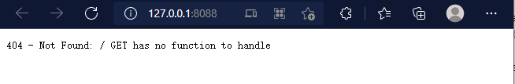
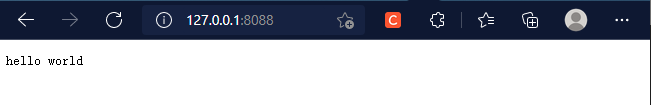
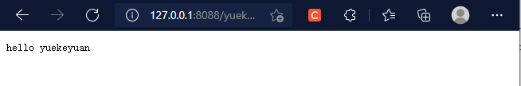

# 编写一个网络服务器

接下来为了说明 IWebCore 的使用，我们创建一个简单的 web 项目

## 创建 一个基本的服务器项目

- 下载IWebCore, 关于 IWebCore 的使用方式， 参考 [IWebCore使用方式](../tips/how_to_use_iwebcore.md)

- 新建一个 `Qt Console Application`,  修改 `*.pro` 文件如下：

    ```properties linenums='1'
    QT -= gui
    QT += sql core network xml
    
    CONFIG += c++11 console
    CONFIG -= app_bundle
    
    include(../../../src/src.pri)
    
    SOURCES += \
            main.cpp
    
    ```

    - 在第2行， 引入 sql, core, network, xml 四个库
    - 在第7行，包含 "IWebCore" 的`src.pri`， 引入 IWebCore 库

- 修改 `main.cpp` 如下：

    ```cpp linenums='1'
    #include <IWebCore>
    
    int main(int argc, char *argv[])
    {
        IWebApplication app(argc, argv);
        
        IHttpServer server;
        server.listen();   
        
        return app.exec();
    }
    ```

    - 在第1行，引入IWebCore库， 这同样是在每一个头文件中需要引用的库。

    - 在第5-10行，初始化 IWebApplication,创建并运行一个server。

    - 这样一个server 就完成了， 先运行运行一下项目, console 输出如下：

        ``` linenums='1'
         _____  _    _        _      _____
        |_   _|| |  | |      | |    /  __ \
          | |  | |  | |  ___ | |__  | /  \/  ___   _ __  ___
          | |  | |/\| | / _ \| '_ \ | |     / _ \ | '__|/ _ \
         _| |_ \  /\  /|  __/| |_) || \__/\| (_) || |  |  __/
         \___/  \/  \/  \___||_.__/  \____/ \___/ |_|   \___|
        
        Load SystemEnvironment
        [√]     Auto Load Resource Task Finish
        server started at 127.0.0.1:8088
        ```

    - and the server will be run at: http://127.0.0.1:8088,  open it in browser and the browser will show: 

        


## 添加一个Controller和首页请求

在上面的例子中，一个服务器创建了，但是没有任何的 url 映射，所以不管什么样url, 都会返回 `404 NOT FOUND` 信息。接下来，我们添加一个 controller 处理 url。

首先，创建 `MyController` 类, 包含  `MyController.h` 和 `MyController.cpp` 两个文件：

头文件的代码是：

```cpp linenums='1'
#pragma once

#include <IWebCore>

class MyController : public IControllerInterface<MyController>
{
    Q_GADGET
    $AsController(MyController)
public:
    MyController() = default;

    $GetMapping(index, /)
    QString index();
};
```

- 第1行 `#pragma once` 开头， 可以查看 []
- 第3行 包含库的头文件
- 第5行 以public 的方式 继承 IControllerInterface.
- 第7行 使用 `Q_GADGET`
- 第8行 使用 $AsController 表示这个是一个 controller 类，
- 第12-13行 定义一个 index 函数,并将函数映射到 `/` 地址， 

源文件如下

```cpp linenums='1'
#include "MyController.h"

QString MyController::index()
{
    return "hello world";
}
```

- 这个并不需要多解释，就是index 函数， 返回 "hello world".

让我们重新运行项目 console 当中输出:

```
 _____  _    _        _      _____
|_   _|| |  | |      | |    /  __ \
  | |  | |  | |  ___ | |__  | /  \/  ___   _ __  ___
  | |  | |/\| | / _ \| '_ \ | |     / _ \ | '__|/ _ \
 _| |_ \  /\  /|  __/| |_) || \__/\| (_) || |  |  __/
 \___/  \/  \/  \___||_.__/  \____/ \___/ |_|   \___|

Load SystemEnvironment
[√]     Auto Load Resource Task Finish
[√]     Controller MyController registered
server started at 127.0.0.1:8088
```

可以看见输出多了第10行， `Controller MyController registered` , 这个表示 controller 已经自动注册到我们的程序里面了，关于如何注册，可以参考[静态注册](../tips/static_initialize_register.md)

我们重新打开 浏览器，输入 http://127.0.0.1:8088, 浏览器输出以下内容:



 可以看到请求成功。

## 再写一个请求

头文件修改如下：

```cpp linenums='1'
#pragma once

#include <IWebCore>

class MyController : public IControllerInterface<MyController>
{
    Q_GADGET
    $AsController(MyController)
public:
    MyController() = default;

    $GetMapping(index, /)
    QString index();

    $IgnoreParamWarn(hello)
    $GetMapping(hello, /<name>)
    QString hello(QString name);
};
```

可以看见 只是添加了15-17 三行代码， 

- 第15 行：这是 `runtime-assertion` 检查的一部分，现在不需要关心，有兴趣可以查看[运行时检查](../tips/runtime_assertion.md)
- 第17行，定义 hello 函数， 并且有一个`QString name` 参数。关于函数参数的设定,请查看[controller函数参数](../tips/controller_function_parameter.md) 
- 第16行，定义个 `GET` 请求，将 `/<name>` url 映射到 hello 函数。 关于`/<name>` 请查看 [url 映射规则](../controller/url_mapping.md)

源文件如下:

```cpp linenums='1'
#include "MyController.h"

QString MyController::index()
{
    return "hello world";
}

QString MyController::hello(QString name)
{
    return "hello " + name;
}
```

依然是一个很普通的函数。

接下来我们打开浏览器输入  http://127.0.0.1/yuekeyuan, 浏览器输出以下内容：



可以看见浏览器返回的正是我们想要的内容.


基本的介绍就到这里，接下来可以学习：

- assertion
- configuration
- controller and mapping
- database, table, view, and model.
