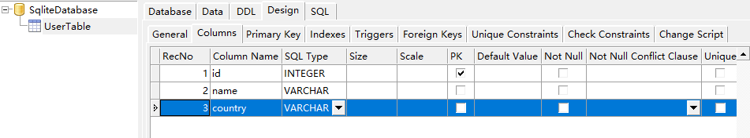
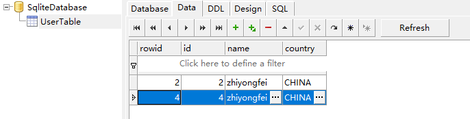

# Orm 简介

> orm 包括了 bean table, view, model 和数据库等一系列的内容，目的是使开发者方便的对数据进行操作，以及使用数据库进行增删改查

下面我们开始一个例子

首先我们创建一个 IWebCore 应用。关于如何创建IWebCore应用，参考[IWebCore使用方式](../tips/how_to_use_iwebcore.md)

## Bean 的创建

在项目当中，我们创建一个UserBean, 头文件如下:

```c++ linenums='1'
// UserBean.h
#pragma once

#include <IWebCore>

class UserBean : public IBeanInterface<UserBean>
{
    Q_GADGET
    $AsBean(UserBean)
public:
    UserBean();

    $BeanField(int, age);

    $BeanFieldDeclare(QString, name)
    QString name;

    $BeanFieldDeclare(QString, country)
    QString country = "CHINA";
};
```

- bean 的定义需要：
    - 以 public 方式继承 IBeanInterface
    - 使用 `Q_GADGET` 和 `$AsBean(klassName)` 两个宏
- 字段的定义也有两种方式：
    - 使用 `$BeanField(type, name)` 来定义一个字段,如上面第13 行
    - 使用 `$BeanFieldDeclare(type, name)` 来声明一个字段， 之后再写上 type name; 定义字段，如15-16行 和  18-19 行所示。

源文件如下：

```cpp linenums='1'
// UserBean.cpp
#include "UserBean.h"

UserBean::UserBean()
{
}
```

我们重新写 main.cpp，用于输出UserBean, 代码如下， 输出也一起写到代码里面，供参考

```c++ linenums='1'
// main.cpp
#include <IWebCore>

#include "UserBean.h"

int main(int argc, char *argv[])
{
    Q_UNUSED(argc)
    Q_UNUSED(argv)

    UserBean bean;
   
    qDebug().noquote() << bean;
    // {"age":0,"country":"CHINA","name":""}
    
    qDebug().noquote() << static_cast<QString>( bean);
    // {"age":0,"country":"CHINA","name":""}
    
    qDebug().noquote() << bean.toString();
	// {"age":0,"country":"CHINA","name":""}
    
    qDebug().noquote() << bean.toJson();
    // QJsonObject({"age":0,"country":"CHINA","name":""})
    
    qDebug().noquote() << bean.toVariantMap();
	// QMap((age, QVariant(int, 0))(country, QVariant(QString, CHINA))(name, QVariant(QString, )))
    
    bean.age = 27;
    bean.name = "yuekeyuan";
    
    
    QJsonObject json = bean.toJson();
    qDebug().noquote() << json;
	// QJsonObject({"age":27,"country":"CHINA","name":"yuekeyuan"})
    
    auto bean1 = UserBean::fromJson(json);
    
    qDebug().noquote() << (bean == bean1) << bean1;
    // true {"age":27,"country":"CHINA","name":"yuekeyuan"}

    bool convertOk;
    auto bean2 = IConvertUtil::toBean<UserBean>(json, &convertOk);
    
    qDebug().noquote() << convertOk  << (bean == bean2) << bean2;
    // true true {"age":27,"country":"CHINA","name":"yuekeyuan"}
}
```

上面是一个 bean 的一些支持方法展示。bean 内置方法很多， 想具体了解可以参考 [Bean](./bean_usage.md)。


## Table 的创建

Table 是继承于 Bean 并添加一些数据库表相关的内容

下面我们同样创建一个 `UserTable` 来展示 代码

```cpp linenums='1'
// UserTable.h
#pragma once

#include <IWebCore>

class UserTable : public IOrmTableInterface<UserTable>
{
    Q_GADGET
    $AsTable(UserTable)
public:
    UserTable();

    $AutoGenerate(id)
    $PrimaryKey(id)
    $Column(int64_t, id);

    $Column(QString, name);

    $ColumnDeclare(QString, country);
    QString country {"CHINA"};
};
```

```cpp linenums='1'
// UserTable.cpp
#include "UserTable.h"

UserTable::UserTable()
{
}
```

Table 的定义和 Bean 的定义很相似

- Table 以 public 方式 继承 IOrmTableInterface.

- 使用 `Q_GADGET` 和 `$AsTable(klassName)` 标注类

- 有两种 方式定义一个字段：

    - 以 $Column(type, name) 定义一个字段， 如 第15行
    - 以  $ColumnDeclare(type, name) 声明一个字段， 并 以 type name; 的方式定义字段。如 19-20 行。

- 同样我们看到 13行， 14行，这是定义一个 主键的标配。 `$PrimaryKey(name)` 定义 name 字段是一个 主键字段。 `$AutoGenerate(name)` 定义主键name 的产生方式。

- 在这些宏之外，还有一些宏

    - `$NotNull(name)` 
    - `$Unique(name)`
    - `$SqlType(name, sqlType)`

    

## DataBase 的创建

IWebOrm 包装了 Qt 的 关系型数据库，并使它更好用。方便起见，我们创建一个 Sqlite 的数据库：

创建 SqliteDataBase 如下：

```cpp linenums='1'
// SqliteDatabase.h
#pragma once

#include <IWebCore>

class SqliteDatabase : public IOrmDatabaseInterface<SqliteDatabase>
{
    $AsDatabase(SqliteDatabase)
public:
    SqliteDatabase();

    virtual IOrmDataSource configDataSource() final;
    virtual void registerTables() final;
};
```

- database 的创建需要以 public 方式继承 IOrmDatabaseInterface
- 使用 	`$AsDatabase(klassName)` 来标记类为 一个 Database类
- 重载 configDataSource 和 registerTables 两个函数。

```cpp linenums='1'
// SqliteDatabase.cpp
#include "SqliteDatabase.h"
#include "UserTable.h"

SqliteDatabase::SqliteDatabase()
{
}

IOrmDataSource SqliteDatabase::configDataSource()
{
    IOrmDataSource source;

    source.driverName = "QSQLITE";
    source.databaseName = "SqliteDatabase.db";

    return source;
}

void SqliteDatabase::registerTables()
{
    registerTable<UserTable>();
}

```

- configDataSource 返回一个封装好的 dataSource 用于创建 database
- registerTables 注册 UserBean。
    - 这里的注册会检查数据库中是否有 UserTable, 如果没有的化，根据于 table 的定义生成创建 table 的sql。当然，开发者也可以在 registerTable 函数中传入 一个QString 类型的sql 用于创建 sql。

现在我们修改 main.cpp 到如下模型：

```cpp linenums='1'
// main.cpp
#include <IWebCore>

#include "UserBean.h"

int main(int argc, char *argv[])
{
    IWebApplication app(argc, argv);

    return app.exec();
}
```


运行代码，会有如下输出：

```
 _____  _    _        _      _____
|_   _|| |  | |      | |    /  __ \
  | |  | |  | |  ___ | |__  | /  \/  ___   _ __  ___
  | |  | |/\| | / _ \| '_ \ | |     / _ \ | '__|/ _ \
 _| |_ \  /\  /|  __/| |_) || \__/\| (_) || |  |  __/
 \___/  \/  \/  \___||_.__/  \____/ \___/ |_|   \___|

Load SystemEnvironment
[√]	 Auto Load Resource Task Finish
[√]	 Database At Class: webCore::IOrmDataSource, At Connection: default, At Db: SqliteDatabase.db, Opened
```

看见在第10行， Database 已经创建。 

我们打开 `SqliteDatabase.db` 查看数据库如下：



看见 数据表 UserTable 已经自动创建。

## Orm Model 的创建

现在已经创建数据表和数据库，我们在创建 model 用于操纵数据表和数据库

创建 UserModel 如下：

```cpp linenums='1'
// UserModel.h
#pragma once

#include <IWebCore>
#include "UserTable.h"

class UserModel : public IOrmTableModelInterface<UserTable>
{
public:
    UserModel();
};
```


```cpp linenums='1'
// UserModel.cpp
#include "UserModel.h"

UserModel::UserModel()
{
}
```

嗯，创建一个model 就是如此简单，以 public 的方式继承 IOrmTableModelInterface 并且传入要操作的Table 类型， 如第7行所示，一个 model 就创建号了。

model 提供方便的内置函数用于增删改查等操作数据库。详情请参考[Model 的使用](./model_usage.md)

我们举几个例子，改写 main.cpp 如下:

```c++ linenums='1'
// main.cpp
#include <IWebCore>

#include "UserTable.h"
#include "UserModel.h"

int main(int argc, char *argv[])
{
    IWebApplication app(argc, argv);

    UserModel model;

    UserTable table1;
    table1.name = "yuekeyuan";
    model.insert(table1);
    qDebug() << table1;

    UserTable table2;
    table2.name = "zhiyongfei";
    model.insert(table2);

    qDebug() << model.count();
    qDebug() << model.findAll();

    model.deleted(table1);
    qDebug() << model.count();
    qDebug() << model.findAll();

    return app.exec();
}
```

一个简单的例子，插入两条数据， 并且删除其中的一条，相关的输出如下：

```cpp linenums='1'

00:35:57: Starting E:\project\cpp\IWeb\build-IWeb-Desktop_Qt_5_14_2_MSVC2017_32bit-Debug\demo\OrmDemo\debug\OrmDemo.exe ...

 _____  _    _        _      _____
|_   _|| |  | |      | |    /  __ \
  | |  | |  | |  ___ | |__  | /  \/  ___   _ __  ___
  | |  | |/\| | / _ \| '_ \ | |     / _ \ | '__|/ _ \
 _| |_ \  /\  /|  __/| |_) || \__/\| (_) || |  |  __/
 \___/  \/  \/  \___||_.__/  \____/ \___/ |_|   \___|

Load SystemEnvironment
[√]	 Auto Load Resource Task Finish
[√]	 Database At Class: webCore::IOrmDataSource, At Connection: default, At Db: SqliteDatabase.db, Opened
"select id from UserTable where rowid = :rowid"
{":rowid":1}
"insert into UserTable ( id, name, country )  values ( :id, :name, :country ) "
{":country":"CHINA",":id":null,":name":"yuekeyuan"}
{"country":"CHINA","id":1,"name":"yuekeyuan"}
"select id from UserTable where rowid = :rowid"
{":rowid":2}
"insert into UserTable ( id, name, country )  values ( :id, :name, :country ) "
{":country":"CHINA",":id":null,":name":"zhiyongfei"}
{"country":"CHINA","id":2,"name":"zhiyongfei"}
"SELECT COUNT(1) FROM UserTable"
2
"SELECT * FROM UserTable"
[{"country":"CHINA","id":1,"name":"yuekeyuan"},{"country":"CHINA","id":2,"name":"zhiyongfei"}]
"DELETE FROM UserTable WHERE id = :id"
{":id":1}
"SELECT COUNT(1) FROM UserTable"
1
"SELECT * FROM UserTable"
[{"country":"CHINA","id":2,"name":"zhiyongfei"}]
```

嗯，很大的一群东西，不过输出是正确的。为了简化输出，我们先屏蔽掉 sql 信息，再查看一遍

在 main 函数前面写上:

```cpp linenums='1'
// main.cpp
#include <IWebCore>

#include "UserTable.h"
#include "UserModel.h"

$EnableSqlInfoPrint(false)
int main(int argc, char *argv[])
{
    IWebApplication app(argc, argv);

    UserModel model;

    .....
}
```

注意第7 行，我们已经禁掉 sql info了，当我们再次运行代码时，输出如下:

``` linenums='1'
 _____  _    _        _      _____
|_   _|| |  | |      | |    /  __ \
  | |  | |  | |  ___ | |__  | /  \/  ___   _ __  ___
  | |  | |/\| | / _ \| '_ \ | |     / _ \ | '__|/ _ \
 _| |_ \  /\  /|  __/| |_) || \__/\| (_) || |  |  __/
 \___/  \/  \/  \___||_.__/  \____/ \___/ |_|   \___|

Load SystemEnvironment
[√]	 Auto Load Resource Task Finish
[√]	 Database At Class: webCore::IOrmDataSource, At Connection: default, At Db: SqliteDatabase.db, Opened
{"country":"CHINA","id":3,"name":"yuekeyuan"}
{"country":"CHINA","id":4,"name":"zhiyongfei"}
3
[{"country":"CHINA","id":2,"name":"zhiyongfei"},{"country":"CHINA","id":3,"name":"yuekeyuan"},{"country":"CHINA","id":4,"name":"zhiyongfei"}]
2
[{"country":"CHINA","id":2,"name":"zhiyongfei"},{"country":"CHINA","id":4,"name":"zhiyongfei"}]
```

数据库里的结果如下:



嗯，一切都是对的,刚刚好。（上面最终输出两条数据，是因为 代码执行了两次）

现在 orm 的鸟瞰已经完成。接下来你可以深入了解: 

- bean
- table
- database
- orm
